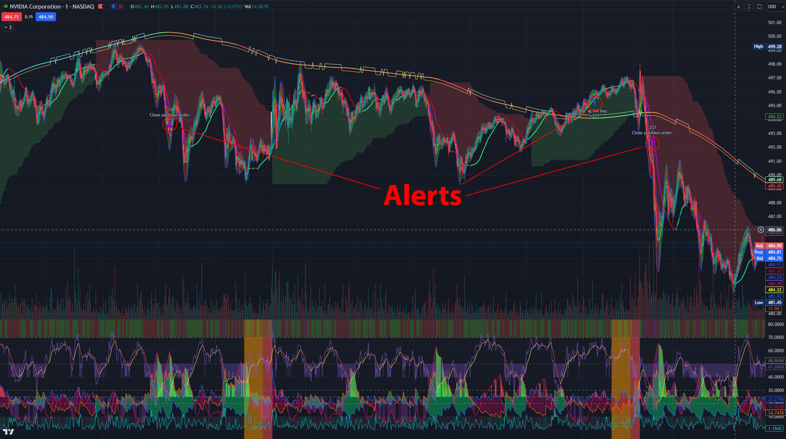

# TradingView-Alpaca-alerts
A python program that receives alerts from TradingView (indicators and strategies) and creates buy/sell orders on Alpaca with real and paper accounts.

**Operation:**
- Right now, this is good for trying strategies out with a paper account (not real trading).
- Generate report will create a CSV daily report for buying and selling with alpaca paperor real stocks. Default is 7 days prior.
- Uses TradingView webhook. Can use ngrok, cloud service, etc. to connect webhook to flask server.
- Compatible with **'Machine Learning: Lorentzian Classification'** indicator alerts (match Close Long, Open Long, etc.)
  - LDC Kernel Bullish ▲ | CLSK@4.015 | (1)...
- Also compatible with strategy alerts (ex. strategy.entry, strategy.close_all, etc.)
  - order sell | MSFT@337.57 | Directional Movement Index...
  -   Add the following to the beginning of a strategy alert for buying/selling order: `{{strategy.order.action}} | {{ticker}}@{{close}} | {{strategy.order.id}}`.
- Stop loss and other similar features should be handled in pine script. 
- Cancels any open order for the specified stock if another order is received then processes new order.
- Checks position before shorting/going long.
- Buy price is received from TradingView webhook for position size calculation.

***
**Known issues:**
- Going short from long position or vice versa doesn't work. Need to wait for order to zero out position then open an order. 
- Need to see about adding something to fill or kill after x time, especially for limit orders. 
- If more than one buy trigger happens too close together the cash available won't reflect both orders and can overspend. There are other failsafes in place to prevent overspending if account balance is negative.

**Future plans:**
- Generate stock/strategy performance analysis dashboard from reports generated.
- Implement order tracking to ensure completion.
- Use order tracking for changing from long to short positions and vice versa.
***
**Settings (adjusted in the settings.json file):**

    {
      # Enable/disable shorting. Not fully implemented yet. 
      # ***Alert(s) needs to say 'short' and you have to close any long positions first.
      "short": False,
      # Hard set at the moment to 20% of the cash balance. Useful in paper testing if you have around 5 stock alerts you want to analyse.
      # Be careful, if more than one order is going through at the the same time, it may spend over the total cash available and go into margins. Mainly a problem in real money trading.
      # Behaves differently when testMode is enabled.
      "buyPerc": 0.2,
      # Balance is set in the function setBalance().
      "balance": 0,
      # Not used
      "buyBal": 0,
      # Gets open potisions to verify ordering. Multiple buys before selling not implemented yet.
      "positions": [],
      # Retrieves open orders is there are any for the symbol requested.
      "orders": [],
      # Gets all the open orders.
      "allOrders": [],
      # Testmode sets the balance to a predetermined amount set in createOrder.
      # Used to not factor in remaining balance * buyPerc after positions are opened.
      "testMode": True,
      # enabled will allow submission of orders.
      "enabled": True,
      # Not used?
      "req": "",
      # Setting to True will impose a predefined limit for trades
      "limit": True,
      # How much to limit the buy/sell price. Order not filled before sell will be canceled. Change to buyPerc setting once stock price >limitThreshold.
      "limitamt": 0.04,
      # Limit threshold $ amount to change to % based limit
      "limitThreshold": 100,
      # limit percent for everything above a certain amount which is predefined for now below.
      "limitPerc": 0.0005,
      # Maxtime in seconds before canceling an order
      "maxTime":10
    }
