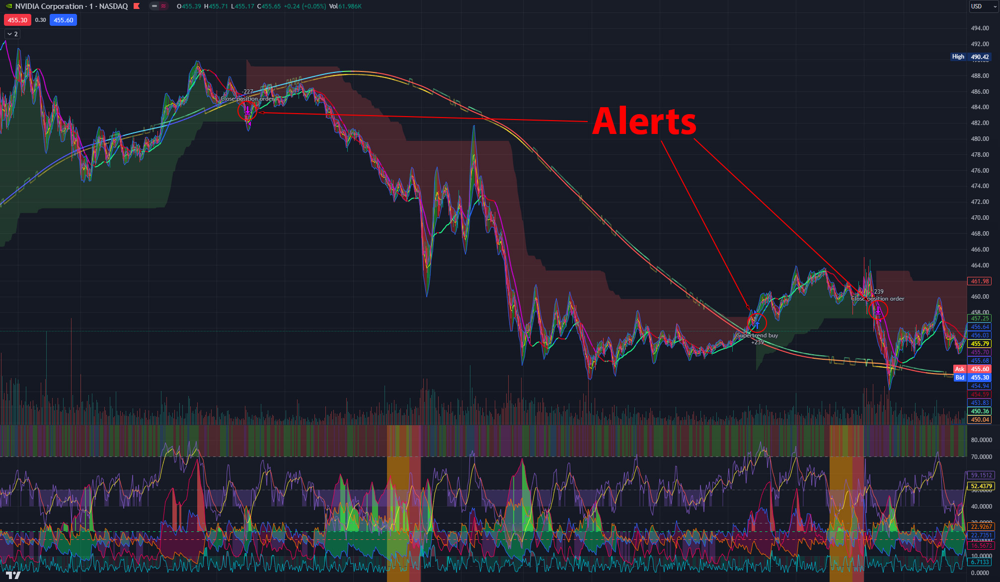

# TradingView-Alpaca-Bridge: Automated Trading with Python

This project is a python program that connects TradingView alerts with Alpaca API to execute buy and sell orders for stocks. It allows you to test and analyze your trading strategies in a fully automated way, using real or paper accounts. You can use any indicators or strategies from TradingView, or create your own, and let this program handle the order management for you.

**Operation:**

- Built on python 3.11. Tested and works natively on windows 10/11 and Amazon Linux 2023 using Python 3.9. Docker not recommended or thoroughly tested, but there if you want to use it.
- **CAUTION**: Do not run tests during trading hours. By design, it should only be placing orders with the paper account, but if you are doing analysis on it that could skew the results if not caught.
- Settings are located in [default_settings.py](default_settings.py). AlpacaTVBridge needs to be restarted for any changes in settings to take effect.
  - **WARNING**: If changing from real back to paper trading and vice versa in the main settings or per stock settings, make sure you close out your current positions if there are any open for the stocks being changed as the program doesn't check or account for changes like that.
  - Copy defaultSettings.py to settings.py so future updates don't change your settings.
- Best use case currently is opening and closing long positions.
- Uses TradingView webhook. Can use [ngrok](https://ngrok.com/), a cloud service (Links and examples to come!), etc. to connect webhook trigger to order action on Alpaca using their API.
  - Add the following to the beginning of a strategy/indicator alert for buying/selling order: `{{strategy.order.action}} | {{ticker}}@{{close}} | {{strategy.order.id}} `...
- Sets position size by incoming price from alpaca and settings (I like it this way to more accurately use backtesting in TradingView without having to worry about a wrong setting on that end). For example, if a buy alert for MSFT triggers, the price will be passed to the main app where it will divide the amount that you apportioned in the settings. If this was $2,000 per trade and the stock was $200, it would submit an order to buy 10 shares.
  - Fractional trading has been added, but needs more testing first. 
  - Fractional trades that are attempted on a stock that doesn't allow it will not complete the trade.
  - If there's already an open order, it will cancel it and place new order as long as there is no position for buying, etc. 
  - If there's already an open position, it will not order more. This is to prevent unintended overbuying.
- Only two order types are sent to Alpaca (Market and Limit). Anything else will need to be handled in TradingView programatically with alerts (like Stoploss selling). Generally I like to have a strategy with a Buy, Sell, and Stoploss alert. This also gives you the ability to do things you can't typically do in Alpaca like having a trailing stop, but it has to be coded in TradingView.
  - Stop loss and other similar features need to be handled in pine scripts.
- Cancels any open order for the specified stock if another order is received then processes the new order.
  - Buying 
    - Any open order for that stock will be canceled and a new one created.
    - This help for fast market movements on limit orders or if there are other open trades placed outside this program.
    - If you already have a position with the stock you are buying/selling, no order will be placed to prevent overbuying. No pyramiding is possible at this time with this program.
  - Shorting
    - Can short if that's all your doing but need to improve the code for it. Need more extensive testing for this as well.
- Checks position before shorting/going long to prevent overbuying/overselling.
- Buy price is received from TradingView webhook for position size calculation based on user settings.
- Great for trying strategies out with paper trading. Use at your own risk for real trading. Working for real trading, but use with caution and read the settings carefully.
- Generate report will create a CSV 30 day report (default) for buying and selling with alpaca paper or real stocks.
- Compatible with jdehorty's **'Machine Learning: Lorentzian Classification'** indicator alerts (match Close Long, Open Long, etc. when creating alerts).
  - Ex. <font color=orange>LDC Kernel Bullish ▲ | CLSK@4.015 | (1)</font>...
- Also compatible with strategy alerts (ex. strategy.entry, strategy.close_all, etc.).
  - <font color=orange>order sell | MSFT@337.57 | </font>Directional Movement Index...

---

**Future plans:**

- Generate stock/strategy performance analysis dashboard from reports generated.
- Use order tracking for changing from long to short positions and vice versa.
- Add fractional trading option.

---

**API keys:**
Add these to your environment an/or .env file:
```
# Paper trading keys:
Alpaca_API_KEY=ASDF...
Alpaca_SECRET_KEY=WERT...

# Real money trading keys:
Alpaca_API_KEY-real=GREJ...
Alpaca_SECRET_KEY-real=XCVJH...
```
***
**Basic setup example:**

#### Here are the steps I took to move this app to a cloud instance:
I went with EC2 by Amazon AWS for no reason in particular. You could use Azure, Google Cloud, etc. 
  - I recommend setting up the security groups to only only traffic from TradingView and computers you want to access it from. 
  - I do not recommend running it in a docker becuase it takes up a lot more resources and doesn't seem necessary, but I could be wrong.
  - Create an instance (micro is more than enough for this), update it and install git.
  - Clone the repo locally.
  - Install the requirements.txt
  - Add the keys to a providers service (Secrets Manager for AWS) and make sure the instance can access them by giving it the right permissions.
  - Add a "getSecureKeys.py" scipt in the Keys folder that returns keys in object format. The provider should give you this code to retrieve these keys. Add them as they appear in the example above.

I used NGINX to recieve my TradingView webhooks using SSL. 
  - Use the reverse proxy option from NGINX to pass the webhooks locally to this app which will use the Alpaca API to place orders.
  - I used certbot for the SSL cert.

Put it all together
  - Use a Python script or Jupyter Notebook to send a test post request to your server to make sure it can be reached and tries to make an order.

to be continued...
***
**Disclaimer:**

This program is for educational and informational purposes only. It is not intended to provide any financial, investment, or trading advice. The author and contributors of this program are not responsible for any losses, damages, or liabilities that may result from using this program. Users should do their own research and due diligence before using this program for real trading. Users should also read and understand the terms and conditions of TradingView and Alpaca before using their services. Use this program at your own risk.
***
**License**

This project is licensed under the GNU General Public License v3.0 - see the LICENSE file for details.

[Licence](License): GPL v3
***

